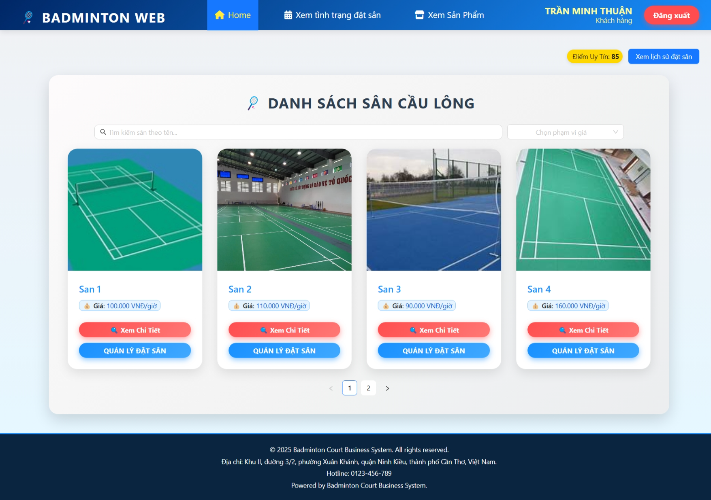
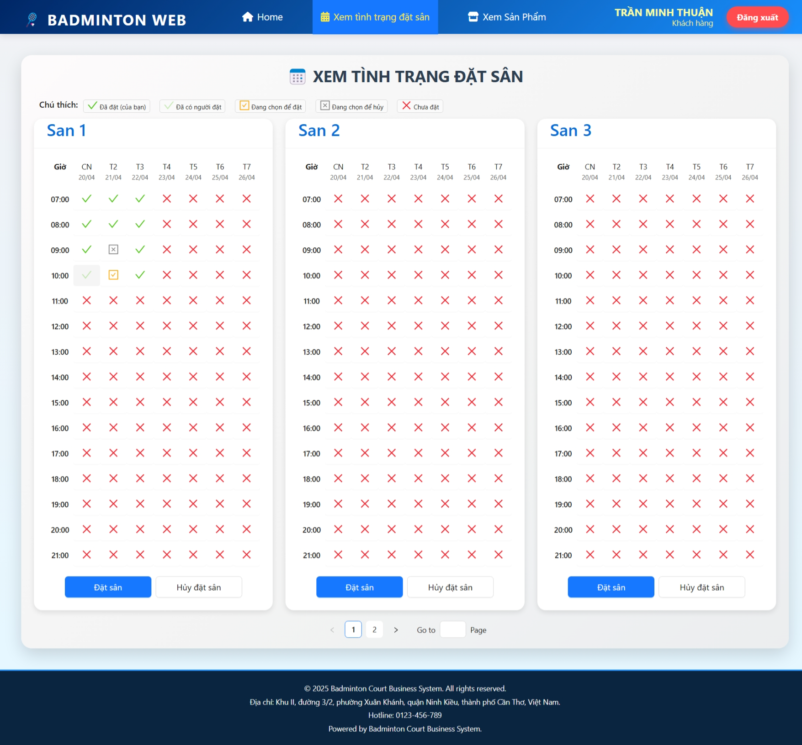
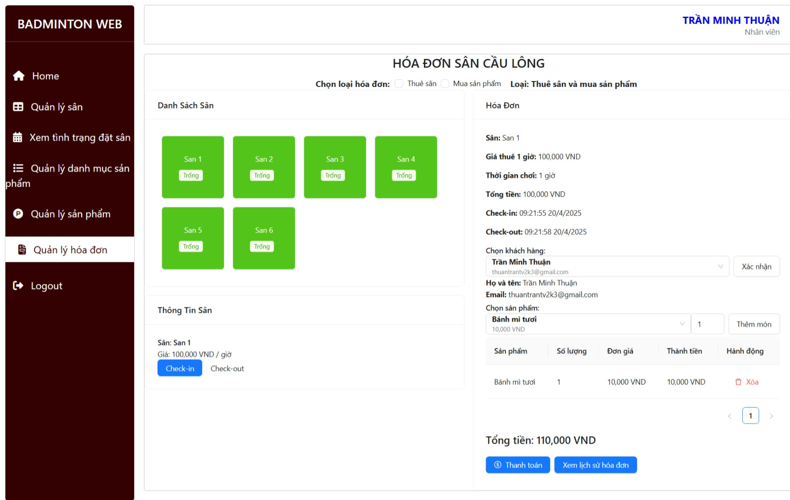
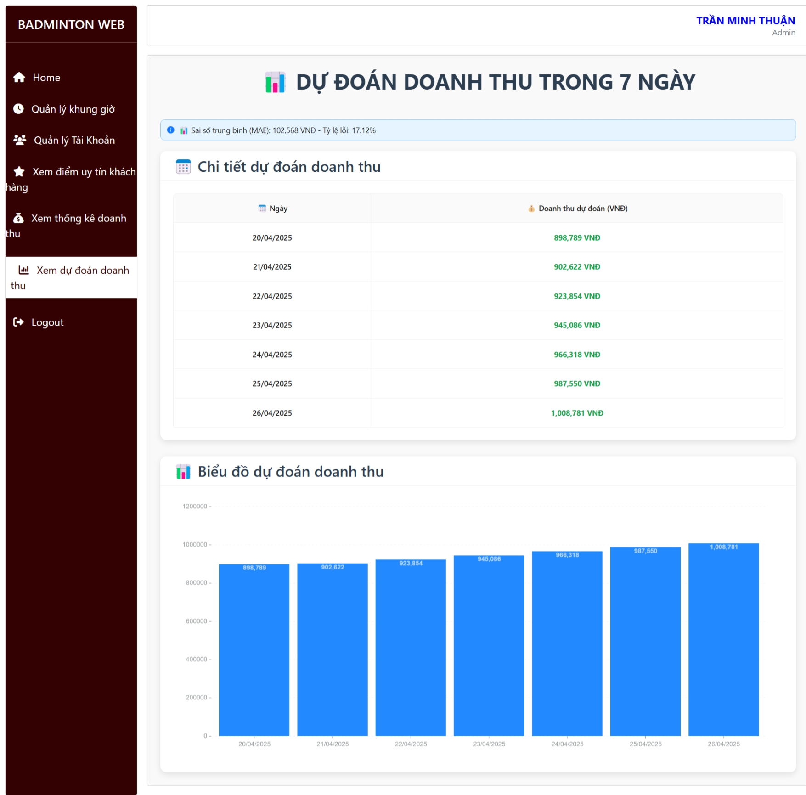

# Dự án Quản lý Sân Cầu Lông

Ứng dụng giúp quản lý hoạt động kinh doanh sân cầu lông: đặt sân, quản lý hóa đơn, bán sản phẩm tại chỗ, và **dự đoán doanh thu bằng mô hình học máy**. Dự án phát triển với **MERN Stack** (MongoDB, ExpressJS, ReactJS, NodeJS) và tích hợp **Python Flask** cho phần dự đoán.

---

## 🎯 Tính năng chính

- 📅 Đặt sân và xem tình trạng đặt sân theo thời gian thực  
- 💵 Quản lý hóa đơn và bán sản phẩm tại chỗ  
- 📈 Dự đoán doanh thu bằng mô hình học máy (Linear Regression)  
- 🧠 Tích hợp mô hình học máy dựa trên dữ liệu lịch sử  
- ✉️ Gửi mail thông báo khi đặt / hủy sân thành công  

---

## 🖼️ Giao diện demo

### Trang chủ


### Xem tình trạng đặt sân


### Quản lý hóa đơn


### Dự đoán doanh thu


---

## Giao diện demo


## Cài đặt

```bash
npm install
npm run dev
cd ml_api
python app.py
